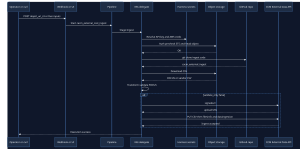

# CACM External Cost Ingest — Architecture

How billing CSVs move from object storage into Harness CCM via the Custom pipeline on a Kubernetes delegate.

## System architecture

*End-to-end flow: curl or manual Run → Harness pipeline on K8s delegate → object storage + GitHub → CCM External Cost Data Source.*

## Runtime sequence

*Sequence for a successful S3 ingest via webhook or manual Run.*

## Components

| Component | Role |
|-----------|------|
| **Custom webhook / UI / Cron** | Starts the pipeline with `object_uri_s3` (and optional invoice fields) |
| **Pipeline `cacm_external_cost_ingest`** | Two ShellScript steps on the K8s Environment/Infra |
| **Cloud Auth Precheck** | Allowlists URI; verifies AWS/GCP/Azure access before ingest |
| **Transform Validate Ingest** | Clones this GitHub repo, downloads CSV, FOCUS transform/validate, CCM APIs |
| **Harness secrets** | API key (`harness_ccm_api_key`) + cloud creds (`account.aws_access_key_id` / `account.aws_secret_access_key`, or project equivalents) |
| **Object storage** | Source of truth for month CSVs (`s3://`, `gs://`, or Azure blob) |
| **GitHub** | Source of the Python job (`cacm_external_ingest`) — not the billing files |
| **CCM External Cost Data Source** | Destination provider UUID (`provider_id`) for signed upload + ingestion |

## Data path (happy path)

1. Operator sends `object_uri_s3` via curl webhook or Pipeline Run.
2. Delegate resolves secrets and proves it can read the object.
3. Delegate clones `external-data-ingestion-sync`, installs deps (uv/pip if needed).
4. CSV is downloaded, transformed to FOCUS, and hard-validated (≤ 20 MB).
5. If `validate_only=false`, the job obtains a CCM signed URL, uploads the file, and triggers dataingestion.
6. Cost data appears on the External Cost Data Source; Perspectives refresh shortly after.
